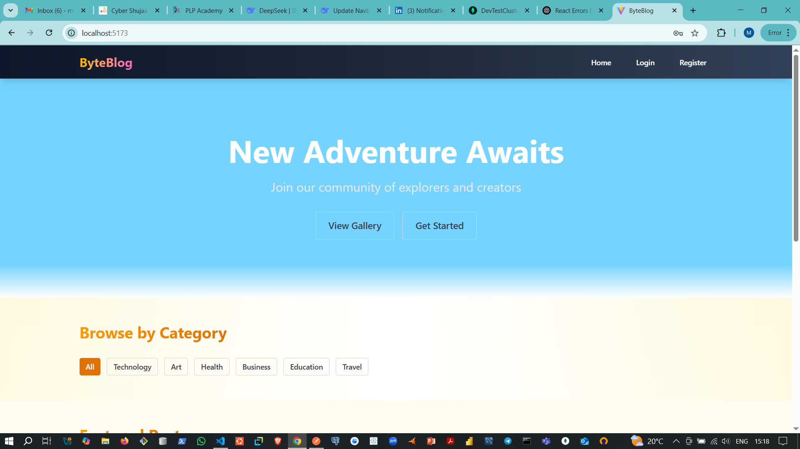
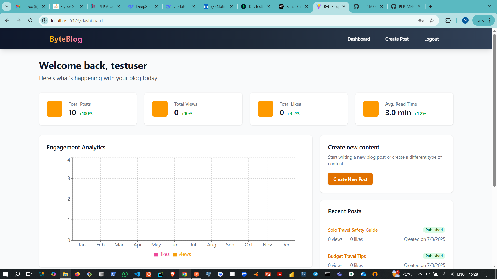
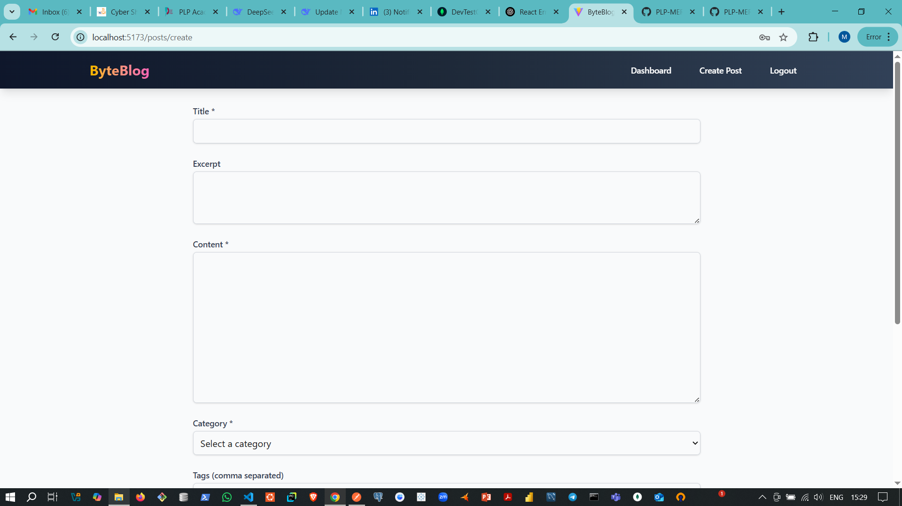

[](https://classroom.github.com/online_ide?assignment_repo_id=19899519&assignment_repo_type=AssignmentRepo)

# 📝 MERN Stack Integration Assignment – BYTEBLOG

This assignment demonstrates a full-stack MERN (MongoDB, Express.js, React.js, Node.js) application called **ByteBlog**, showcasing seamless integration between front-end and back-end components.

**🔗 Repository:** [github.com/PLP-MERN-Stack-Development/BYTEBLOG](https://github.com/PLP-MERN-Stack-Development/BYTEBLOG)

---

## 📚 Assignment Overview

You will build and deploy a blog platform with the following core features:

✅ RESTful API with Express.js and MongoDB  
✅ Component-based React front-end  
✅ Full CRUD functionality for blog posts  
✅ User authentication and role-based authorization  
✅ Advanced features: image uploads, post analytics, and commenting system

---

## 📁 Project Structure

mern-blog/
├── client/ # React front-end
│ ├── public/ # Static files and images
│ ├── src/ # React source code
│ │ ├── components/ # Reusable UI components
│ │ ├── pages/ # Page-level components
│ │ ├── hooks/ # Custom React hooks
│ │ ├── services/ # API request functions
│ │ ├── context/ # Context API for global state
│ │ └── App.jsx # Root application component
│ └── package.json # Frontend dependencies
├── server/ # Express.js back-end
│ ├── config/ # MongoDB and environment config
│ ├── controllers/ # Business logic for routes
│ ├── models/ # Mongoose schemas
│ ├── routes/ # Express route handlers
│ ├── middleware/ # Auth and error handling
│ ├── utils/ # Helper functions
│ ├── server.js # Application entry point
│ └── package.json # Backend dependencies
└── README.md # Project documentation


---

## 🚀 Getting Started

1. **Accept the assignment** via GitHub Classroom.
2. **Clone the repository:**
   ```bash
   git clone https://github.com/PLP-MERN-Stack-Development/BYTEBLOG.git

Install dependencies:

bash
Copy
Edit
cd server && npm install
cd ../client && npm install
Set up environment variables in .env files (refer to Week4-Assignment.md).

Run the app locally:

Server:

bash
Copy
Edit
cd server && npm run dev
Client:

bash
Copy
Edit
cd client && npm start
🧪 Features Implemented
🔐 User Registration & Login (JWT-based)

✍️ Rich Text Editor for blog content

🖼️ Image Uploads via Cloudinary

📊 Post Analytics (views and likes per month)

💬 Comments section

📂 Dashboard for managing posts

📱 Fully responsive with Tailwind CSS

✅ Requirements
Node.js (v18 or higher)

MongoDB (local or Atlas)

Git & GitHub

npm or yarn

## 📸 Screenshots

### 🏠 Home Page


### 🛠️ Dashboard


### 📝 Create Post



📚 Resources
MongoDB Docs

Express.js Docs

React Docs

Node.js Docs

Mongoose Docs


